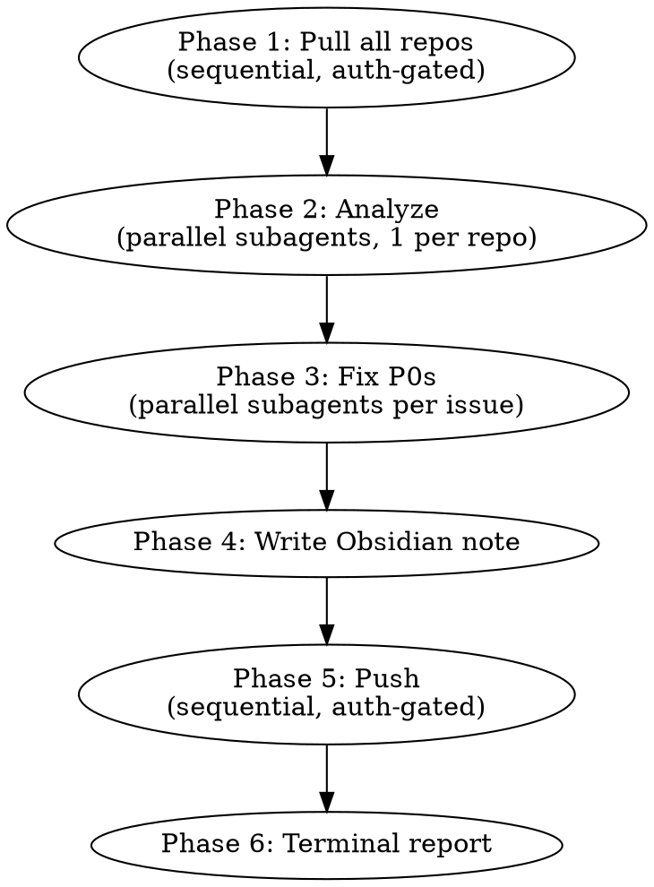

# Daily Orchestration

Autonomous daily sweep: pull all repos, analyze health, fix P0s via subagents, write Obsidian daily note, push everything.

## Repo Registry

```
REPOS=(devloop kan braid minibox obfsck devkit doob magi tools notfiles personal-mcp dumcp notes steve romp pieces-ob inflection gooey goder dotfiles)
DEV=~/dev
```

**Language map** (determines fallback analysis):

| Lang | Repos |
|------|-------|
| Rust | devloop, kan, braid, minibox, obfsck, doob, tools, notfiles, personal-mcp, romp, gooey |
| Go | devkit, dumcp, inflection, goder |
| Python | steve |
| Other | pieces-ob (obsidian plugin), magi, notes, dotfiles (shell/config) |

## Phase 0: Auth Gate (once per session)

Before touching any repo, verify the session is live:

```bash
# Verify 1Password is unlocked (needed for secret resolution in analyze phase)
op whoami --account=my.1password.com 2>&1
```

If this fails with "not signed in" or "authorization prompt":
1. Tell the user: "Touch ID needed — 1Password is locked. Scan once and I'll handle the rest."
2. Wait for confirmation. Do NOT proceed until `op whoami` succeeds.
3. This is the ONE AND ONLY auth prompt for the entire orchestration run.

SSH auth uses the native macOS agent (no Touch ID needed). The `~/.ssh/config` routes only `$INFRA_VPS_HOST` and `$INFRA_MAC_MINI_HOST` through 1Password's agent.

**After Phase 0 succeeds, no further auth prompts.** If auth fails mid-run (e.g., 1Password auto-locked), do NOT re-prompt — report the failure and stop.

## Phase 1: Pull

```bash
for repo in "${REPOS[@]}"; do
  DIR="$DEV/$repo"
  [ ! -d "$DIR/.git" ] && echo "SKIP $repo (not a git repo)" && continue
  BRANCH=$(git -C "$DIR" symbolic-ref --short HEAD 2>/dev/null)
  git -C "$DIR" pull --ff-only origin "${BRANCH:-main}" 2>&1 || echo "PULL_FAIL $repo"
done
```

**Auth error handling:** If a pull fails with auth errors after Phase 0 passed, something changed (lid close, 1Password auto-lock). Stop and report — don't re-prompt.

## Phase 2: Analyze (parallel subagents)

Spawn one Agent per repo (subagent_type: `general-purpose`). Each agent:

### Council analysis (primary path)

```bash
export OPENAI_API_KEY=$(sed -n 's/^OPENAI_API_KEY=//p' ~/.secrets)
timeout 120 devloop analyze --council --council-mode standard --repo $DEV/<repo>
```

If `devloop` binary is missing or council times out (exit 124), fall back.

### Fallback analysis

**Rust repos:**
```bash
cd $DEV/<repo>
cargo clippy --all-targets 2>&1 | tail -30
cargo nextest run --no-fail-fast 2>&1 | tail -40
```

**Go repos:**
```bash
cd $DEV/<repo>
go vet ./... 2>&1 | tail -30
go test ./... -count=1 2>&1 | tail -40
```

**Python repos:**
```bash
cd $DEV/<repo>
uv run ruff check . 2>&1 | tail -30
uv run pytest --tb=short 2>&1 | tail -40
```

**Other repos (no build system):** Just report `git log --oneline -10`.

### Each subagent returns structured output

```
REPO: <name>
STATUS: healthy | warnings | p0_issues
COUNCIL_HEALTH: <score or "skipped">
P0_ISSUES: [list of critical items, or "none"]
WARNINGS: [list]
FALLBACK_USED: true | false
```

## Phase 3: Fix P0s (subagents with commit verification)

For each repo with `STATUS: p0_issues`, spawn a **separate** Agent (subagent_type: `general-purpose`). Each fix-agent:

1. Read the P0 issue description
2. Attempt the fix
3. Run the relevant test suite to verify
4. **MUST** check `git status` before reporting success:
   - If uncommitted changes exist → auto-commit:
     ```bash
     git add -A && git commit -m "fix: <description of P0 fix>

     Co-Authored-By: Claude Opus 4.6 <noreply@anthropic.com>"
     ```
   - If commit fails (1Password lock) → pause and prompt user ONCE, same as Phase 1
5. Report: `FIX_APPLIED: <repo> — <description>` or `FIX_FAILED: <repo> — <reason>`

### Self-repair on broken symlinks / missing tools

If a fix-agent encounters:
- **Broken symlink**: Log the path, attempt `ln -sf <target> <link>` if target is discoverable
- **Missing tool** (e.g., `cargo-nextest`, `bacon`, `ruff`): Attempt install:
  - Rust: `cargo install <tool>` or `cargo binstall <tool>`
  - Python: `uv tool install <tool>`
  - Go: `go install <pkg>@latest`
- **After self-repair**: Retry the original operation exactly ONCE
- **If retry fails**: Log `SELF_REPAIR_FAILED: <repo> — <tool/symlink> — <error>` and move on

## Phase 4: Synthesize to Obsidian Daily Note

```bash
VAULT="/Users/joe/Documents/Obsidian Vault"
TODAY=$(date +%Y-%m-%d)
DAILY="$VAULT/01_Daily/$TODAY.md"
```

If daily note doesn't exist, create from template at `$VAULT/08_Templates/Template - Daily.md` with frontmatter:

```yaml
---
type: daily
date: YYYY-MM-DD
tags: [daily, log, orchestration]
focus:
  - project: daily-orchestration
  - theme: repo health sweep
---
```

Append (never overwrite) a section `## Daily Orchestration — YYYY-MM-DD` with these subsections:

### Timeline

Per-repo one-liner, grouped by status:

```markdown
### Timeline
**Healthy:** minibox, doob, devkit, goder (4 repos, all green)
**Warnings:** devloop (clippy: 3 warnings), braid (1 flaky test)
**P0 Fixed:** obfsck (broken symlink in bin/), kan (test regression in parser)
**P0 Remaining:** inflection (go vet: unreachable code in handler.go)
**Skipped:** magi (not a git repo), notes (not a git repo)
```

### Fixes Applied

```markdown
### Fixes Applied
- **obfsck** — Re-linked `bin/obfsck` -> `target/release/obfsck` (broken after cargo install)
- **kan** — Fixed parser regression: off-by-one in token boundary check (`src/parser.rs:142`)
```

### Remaining Issues

```markdown
### Remaining Issues
- **inflection** — `handler.go:88`: unreachable code after early return (needs human decision on intent)
- **braid** — Flaky test `test_concurrent_dispatch` (passes 4/5 runs, likely timing)
```

### Tomorrow's Priorities

Synthesize — don't just repeat remaining issues. Identify:
- Which remaining issues block other work
- Which repos had the most churn (likely need attention)
- Any cross-repo themes (e.g., "3 repos had stale lockfiles")

```markdown
### Tomorrow's Priorities
1. Fix inflection handler dead code — blocks the /status endpoint rollout
2. Investigate braid flaky test — appeared after async refactor, may indicate race condition
3. Bulk dependency update — 5 repos have outdated lockfiles
```

## Phase 5: Push

```bash
for repo in "${REPOS[@]}"; do
  DIR="$DEV/$repo"
  [ ! -d "$DIR/.git" ] && continue
  AHEAD=$(git -C "$DIR" rev-list --count @{upstream}..HEAD 2>/dev/null || echo "0")
  [ "$AHEAD" = "0" ] && continue
  git -C "$DIR" push 2>&1 || echo "PUSH_FAIL $repo"
done
```

**Auth error handling:** Same as Phase 1 — pause and prompt once on auth failure.

## Phase 6: Final Report

Print to terminal:

```
=== Daily Orchestration Complete ===
Repos scanned: 20
Healthy: 12 | Warnings: 3 | P0 Fixed: 2 | P0 Remaining: 1 | Skipped: 2
Pushed: 4 repos with new commits
Daily note: /Users/joe/Documents/Obsidian Vault/01_Daily/YYYY-MM-DD.md

Auth pauses: 0
Self-repairs: 1 (obfsck symlink)
```

## Execution Strategy



**Parallelism rules:**
- Phase 1 (pull): Sequential — need to detect auth failure early
- Phase 2 (analyze): Parallel — up to 5 concurrent subagents to avoid rate limits
- Phase 3 (fix): Parallel — one subagent per P0 repo
- Phase 4 (synthesize): Sequential — single writer to vault
- Phase 5 (push): Sequential — auth-gated like pull

## Common Mistakes

| Mistake | Fix |
|---|---|
| Silently skipping auth failures | MUST pause and prompt user — the whole point is visibility |
| Running council on non-git dirs | Check `.git` exists first |
| Committing with `git add .` in wrong dir | Always `cd` into repo first, use repo-scoped paths |
| Overwriting existing daily note content | APPEND under new section header — never overwrite |
| Spawning 19 concurrent subagents | Cap at 5 concurrent to avoid API rate limits |
| Forgetting to verify git status in fix-agents | Fix-agent MUST check status and auto-commit before reporting success |
| Retrying auth failures in a loop | ONE prompt to user, then wait — no silent retries |
